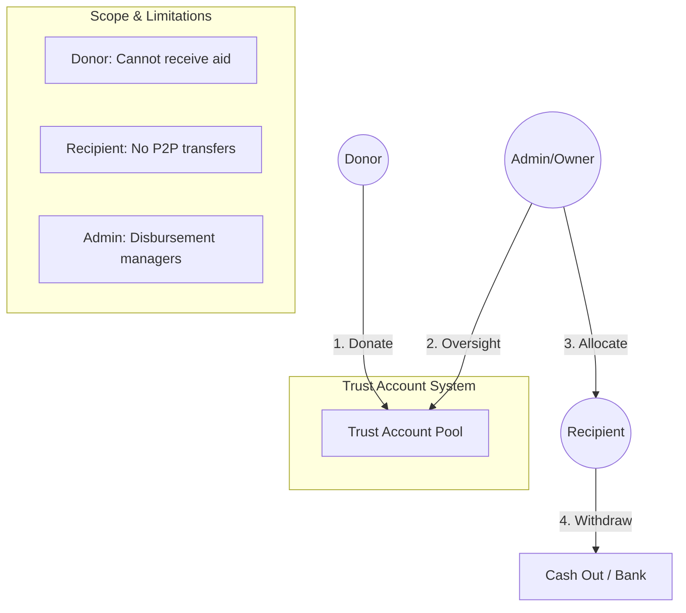

# Implementation Plan: Trust Account Model (Simplified)

Migration from a P2P aid model to a centralized **Trust Account** model focusing on direct disbursements and withdrawals.

## Goal
Establish a central "Trust Account" managed by Admins. Donors contribute to this pool, and Admins distribute funds from the pool to Recipients, who can then withdraw the funds.

## User Flow & Interactions

### Roles and Permissions
| Role | Primary Action | Limitations |
| :--- | :--- | :--- |
| **Donor** | Contribute funds to Trust Pool | No personal balance, cannot receive aid |
| **Recipient** | Receive aid & Withdraw | Cannot donate to pool, cannot send money |
| **Admin** | Allocate funds to Recipients | Cannot receive aid, manages global pool |

---

## Proposed Changes

### 1. Database Schema
#### [MODIFY] [user_model.dart](file:///c:/Users/pain4/Downloads/AI%20Course%20-%20LeverifyQuest/HaqDaar/lib/src/core/models/user_model.dart)
- Simplify `UserRole` enum: `donor`, `recipient`, `admin`. (Remove `merchant`).
- Add `withdrawalMethod` details (optional).

#### [NEW] [trust_account document]
- Path: `system/trust_account`
- Fields:
  - `balance`: double (Current total pool)
  - `totalDonations`: double (Historical total)
  - `totalDisbursements`: double (Historical total)

### 2. Services Logic
#### [MODIFY] [firestore_service.dart](file:///c:/Users/pain4/Downloads/AI%20Course%20-%20LeverifyQuest/HaqDaar/lib/src/core/services/firestore_service.dart)
- **`donateToTrust(double amount)`**:
  - Increments `system/trust_account/balance`.
  - Records a transaction of type `donation`.
- **`allocateAid(String recipientId, double amount)`**:
  - **Transaction**:
    - Decrements `system/trust_account/balance`.
    - Increments `users/{recipientId}/balance`.
    - Records a transaction for both the Trust and the Recipient.
- **`requestWithdrawal(double amount)`**:
  - Validates recipient balance.
  - Decrements recipient balance.
  - Creates a withdrawal request for admin review (or immediate mock success).

### 3. UI Components
- **Donor Dashboard**: 
  - "Quick Donate" interface.
  - Impact summary (Total pool size).
- **Admin Dashboard**:
  - Global pool management.
  - "Disbursement" tab: List recipients and allocate funds.
  - "Withdrawals" tab: Approve recipient cash-out requests.
- **Recipient Dashboard**:
  - Large "Available Balance" card.
  - "Withdraw to Cash" or "Withdraw to Bank" button.
  - History of received aid.

### 4. Security Rules
#### [MODIFY] [firestore.rules](file:///c:/Users/pain4/Downloads/AI%20Course%20-%20LeverifyQuest/HaqDaar/firestore.rules)
- Restrict `write` access to `system/trust_account` to `admin` role only.
- Ensure recipients can only modify their own balance through authorized withdrawal/allocation methods.

---

## Verification Plan

### Automated Tests
- `flutter test` for transaction integrity (ensuring no money is "lost" during allocation or withdrawal).
- Mock withdrawal flow tests.

### Manual Verification
1. Log in as **Donor**, donate Rs. 5000. Verify global pool.
2. Log in as **Admin**, allocate Rs. 1000 to **Recipient B**. 
3. Log in as **Recipient B**, verify balance is Rs. 1000.
4. Perform a **Withdrawal** for Rs. 500. Verify balance drops to Rs. 500.
