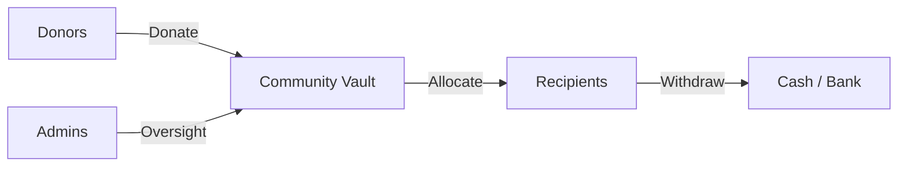

# Workflow: Simplified HaqDaar Trust Account Model

This model centralizes all aid into a **Trust Account**. Donors fund the pool, Admins manage the distribution, and Recipients can withdraw their allocated funds as cash.

## Visual Workflow

---

## User Interactions & Scope

### 1. Donors
- **Interaction**: Contribute funds to the Community Vault.
- **Scope**: View impact stats (total pool size, total families helped).
- **Limitations**: No personal balance; cannot receive aid.

### 2. Admins (Owners)
- **Interaction**: Monitor vault balance; allocate funds to recipients; approve withdrawal requests.
- **Scope**: Full control over disbursement and recipient verification.
- **Limitations**: Funds are locked to the distribution system.

### 3. Recipients (HaqDaar)
- **Interaction**: Receive notifications of aid; initiate withdrawal to cash/bank.
- **Scope**: Manage their digital balance and track aid history.
- **Limitations**: Cannot send money to other users; cannot donate to the pool.

---

## Key Implementation Steps
1. **Centralized Vault**: Dedicated Firestore doc for the Trust Account balance.
2. **Withdrawal System**: 
   - Add a `Withdraw` button for Recipients.
   - Implement a `withdrawalRequests` collection for Admins to track and approve payouts.
3. **Role-Based UI**:
   - **Donor**: Simplified donation-focused UI.
   - **Admin**: A "Finance Management" dashboard.
   - **Recipient**: A "Wallet" focused on receiving and cashing out.

> [!TIP]
> This "Direct-to-Recipient" model reduces friction by allowing users to use the money however they need (cash/bank), while maintaining strict Admin oversight.

For the full technical details, please refer to the [TRUST_ACCOUNT_PLAN.md](file:///c:/Users/pain4/Downloads/AI%20Course%20-%20LeverifyQuest/HaqDaar/TRUST_ACCOUNT_PLAN.md).
